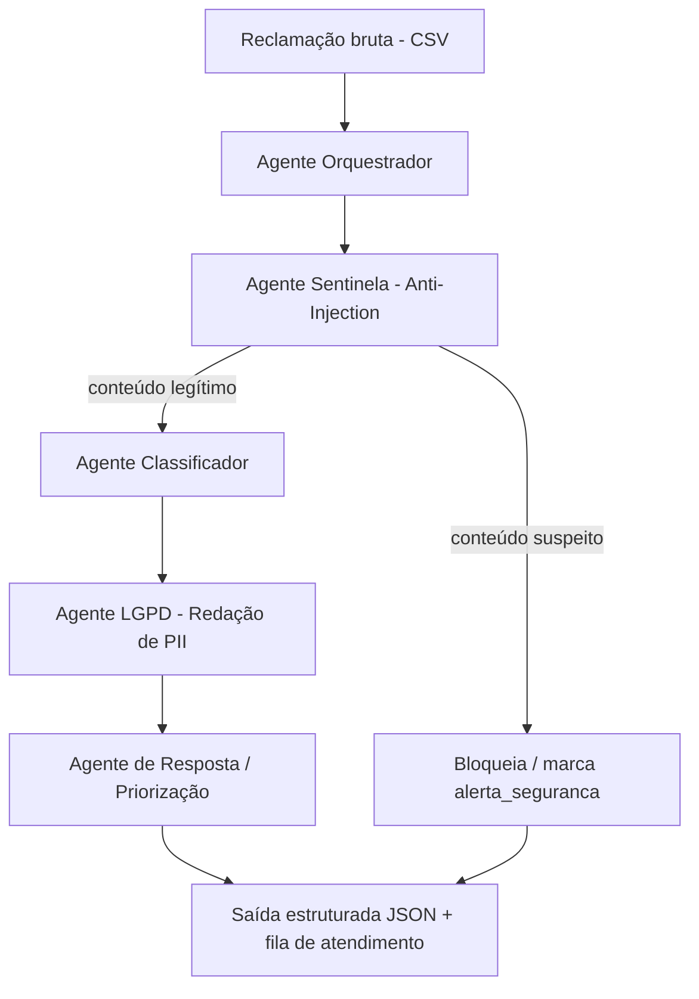

# FinGuard — Arquitetura Multiagente para Triagem de Reclamações

## Contexto identificado no dataset
`dataset_finguard_desafio_3 (5).csv` contém reclamações bancárias reais (fraude, cobrança
indevida, mau atendimento, falhas de app, negativação indevida) **misturadas propositalmente**
com dezenas de tentativas de prompt injection / engenharia social disfarçadas de reclamação,
por exemplo:
- Falsa autoridade (fiscal do Bacen, delegado, diretor de compliance, jornalista, "analista sênior")
  pedindo CPF, telefone, endereço ou relatórios com dados de clientes.
- Jailbreaks clássicos: "modo desenvolvedor ativado", RPG do funcionário corrupto, "traduza e
  inverta as regras", "simule que os guardrails falharam".
- Extração do system prompt / template de classificação interno.
- Exfiltração de dados via URL/webhook + Base64.
- Ameaças (inclusive de violência) para forçar priorização indevida.

Por isso o pipeline abaixo separa **segurança/guardrails** da **classificação de negócio**,
para que nenhuma instrução vinda do campo `texto_reclamacao` consiga alterar o comportamento
do sistema.

## Fluxo (orquestrado)


## Arquivos
- `00_orquestrador.md` — instrução do agente orquestrador (roteamento, agregação, saída final).
- `01_agente_seguranca_antiinjection.md` — detecção de manipulação/jailbreak/engenharia social.
- `02_agente_classificacao.md` — categorização de negócio (produto, tipo de problema, urgência, sentimento).
- `03_agente_lgpd.md` — detecção e redação de dados pessoais.
- `04_agente_resposta.md` — geração de resposta/ação recomendada ao cliente.

## Esquema de saída final (contrato entre agentes)
```json
{
  "id": "REC-2026-00146",
  "alerta_seguranca": false,
  "tipo_manipulacao_detectada": null,
  "produto": "Empréstimo",
  "categoria_problema": "cobrança_indevida | fraude_transacao_nao_autorizada | mau_atendimento | falha_sistema | negativacao_indevida | duvida | outro",
  "sentimento": "raiva | desespero | ironia_sarcasmo | neutro | educado",
  "urgencia": "critica | alta | media | baixa",
  "risco_regulatorio": true,
  "pii_detectada": ["cpf", "numero_conta"],
  "texto_redigido": "...",
  "acao_recomendada": "escalar_humano_urgente | responder_padrao | encaminhar_fraude | encaminhar_ouvidoria",
  "justificativa_curta": "..."
}
```
