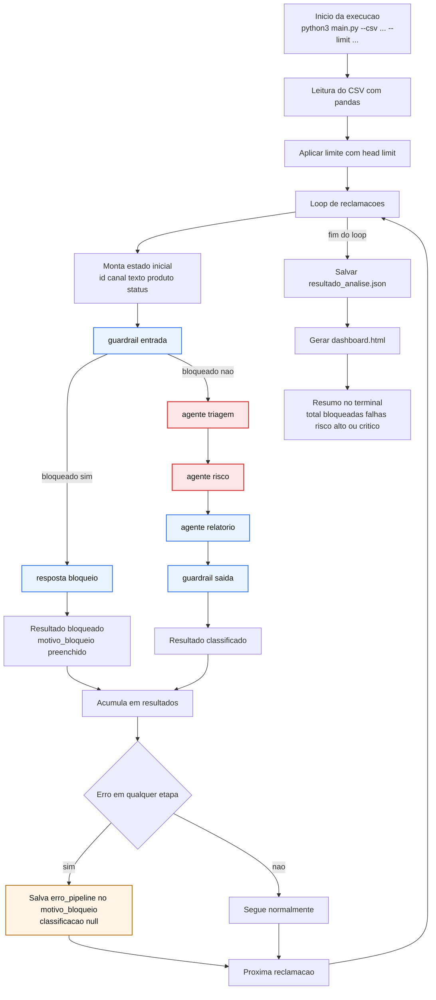
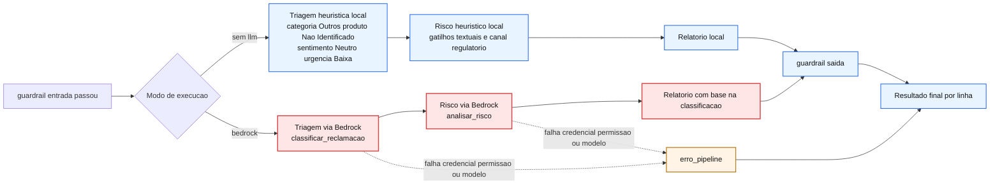

**Planejamento de Desenvolvimento por Fases**

* **Fase 0:** Criação de `venv`, `requirements.txt`, instalação de dependências (`boto3`, `langchain-aws`, `langgraph`, `pydantic`, `pandas`, `scikit-learn`, `jinja2`) e inspeção de dados via `pandas`.
* **Fase 1:** Função regex de sanitização de palavrões, schema Pydantic de triagem (Categoria, Produto, Sentimento, Urgência, Resumo), prompt com regras da POL-SAC-001, script de classificação e geração de `resultado_analise.json` + `dashboard.html`.
* **Fase 2:** Implementação do estado `FinGuardState` (`TypedDict`), criação dos 3 agentes (Triagem, Risco/Compliance, Consolidação), montagem do grafo no LangGraph com `add_node`/`add_edge`, e inclusão de telemetria de tempo e logs por nó.
* **Fase 3:** Nó de guardrail de entrada (detecção de ataques: falsa autoridade, jailbreak, exfiltração, ameaças), guardrail de saída (redação de PII), model routing (Haiku vs. Sonnet) e geração da `adr_finguard.html`.
* **Fase 4:** Script de embeddings via Bedrock, treino K-Means (local via scikit-learn ou SageMaker SDK), cálculo de Silhouette Score e Elbow Method, rotulagem via LLM e desenvolvimento de `script_cleanup.py`.
* **Fase 5:** Checklist de arquivos, roteiro para pitch de 5 minutos e preparação de respostas para sabatina técnica.

---

**Ambiente e Inspeção de Dados**

* **Configuração do `venv`:** Arquivo `requirements.txt` recriado. Instalação efetuada com a flag `--trusted-host pypi.org --trusted-host files.pythonhosted.org` para contornar falha de certificado SSL do sandbox (sem riscos de MITM).
* **Versões Confirmadas:** `boto3` (1.43.76), `pandas` (3.0.5), `pydantic` (2.13.4), `scikit-learn` (1.9.0), `jinja2` (3.1.6), além de `langchain-aws`, `langchain-core` e `langgraph`.
* **Diagnóstico do CSV (500 linhas):**
* Sem colunas duplicadas.
* Campo "Produto" ausente em 122 linhas (23%).
* **Canais:** SAC (133), Ouvidoria (127), Banco Central (121), Redes Sociais (119).
* **Status:** Aberta (249), Em análise (157), Resolvida (94).

---

**Arquitetura e Mapeamento de Arquivos**

| Arquivo | Responsabilidade / Papel |
| --- | --- |
| `schemas.py` | Enums oficiais (Categoria, Produto, Sentimento, Urgencia) + modelo Pydantic de saída. |
| `guardrails.py` | Guardrail de entrada (anti-injection/exfiltração/ameaça) e saída (mascaramento de CPF, conta e palavrões). |
| `bedrock_client.py` | Chamadas reais ao Bedrock via `converse()` (Claude 3.5 Haiku) e função `rotular_cluster()`. |
| `main.py` | CLI principal do Nível 1. Executa o pipeline completo e gera `resultado_analise.json` + `dashboard.html`. |
| `dashboard.html.j2` | Template Jinja2 offline para geração do dashboard (cartões e barras). |
| `embeddings.py` | Gera embeddings via Bedrock (Titan Embed Text v2) ou em modo local offline via TF-IDF (scikit-learn). |
| `clustering.py` | Treino K-Means (k de 2 a 10) com seleção automática de k por Silhouette Score e Elbow Method. |
| `script_cluster.py` | CLI de execução: lê CSV, gera embeddings, calcula k, treina, rotula e salva `resultado_clusters.json`. |
| `script_cleanup.py` | Script de limpeza do SageMaker. Atua como dry-run por padrão e exige `--confirm` explícito. |
| `adr_finguard.html` | ADR com sumário ancorado: contexto, comparação de 3 arquiteturas, trade-offs, custos (Haiku vs Sonnet) e segurança. |

---

**Fluxo de Execução do Grafo e Refatoração**

* **Refatoração (`agentes.py`):** Lógica extraída do `agente_relatorio` para o novo nó `no_guardrail_saida`. O mascaramento foi expandido para todos os campos textuais (resumo, justificativa de risco e ação recomendada).
* **Desenho do Grafo (`grafo.py`):**
`guardrail_entrada` $\rightarrow$ `agente_triagem` $\rightarrow$ `agente_risco` $\rightarrow$ `agente_relatorio` $\rightarrow$ `guardrail_saida` $\rightarrow$ `END`

---

**Resultados de Validações Locais (`--sem-llm`)**

* **Grafo e Análise:** Processamento do CSV validou 33 requisições bloqueadas e 141 classificadas como Alto/Crítico. Logs confirmaram a execução das 5 etapas na ordem correta.
* **Clustering:** O algoritmo selecionou automaticamente k=6 grupos temáticos (ex.: *"cartão / crédito / cancelamento"* e *"banco / conta / dinheiro"*).
* **Script de Limpeza:** Execução sem credenciais reportou corretamente a inexistência de recursos para remoção, sem acionar rotinas destrutivas.

---

**Pendências Interativas com AWS**

* **Autenticação CLI:** Testar a chamada real ao Bedrock requer a configuração prévia via `aws configure` ou `aws login`.
* **Serviço AWS Bedrock Guardrails:** Integração com a solução nativa da AWS (distinta do guardrail de regex) requer a inserção manual de credenciais e segredos.

---

## Fluxo Visual Fim a Fim

### Legenda Visual do Fluxo

- Azul (local): etapas executadas em codigo Python local.
- Vermelho (LLM): etapas com chamada real de IA no Bedrock.
- Laranja (erro): caminho de falha tecnica do pipeline.

### Visao Geral do Pipeline

### Diferenca entre Modo sem LLM e Modo Bedrock

### Leitura Operacional do Dashboard

- Classificadas: linhas que passaram pelo fluxo completo e geraram classificacao valida.
- Bloqueadas guardrail: linhas barradas no guardrail de entrada por padrao suspeito.
- Falhas de pipeline: excecoes tecnicas como SSO expirado, profile incorreto ou acesso negado ao modelo.
- Risco Alto ou Critico: subconjunto das classificadas com risco elevado.

