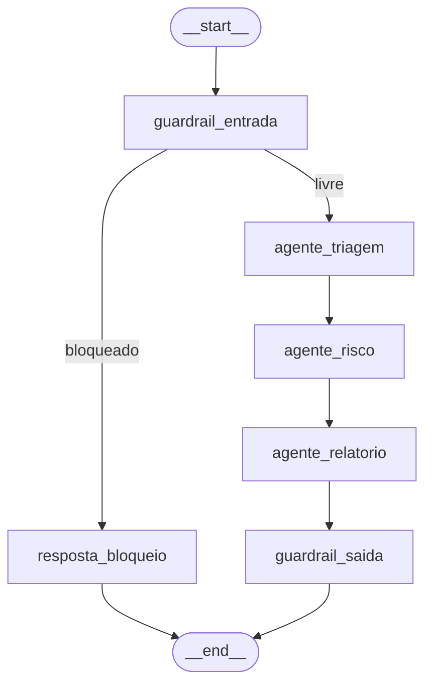

Agora tenho um panorama completo do projeto. Aqui está a análise:

## O que é o FinGuard

É a solução do desafio **Future Minds** (FinTech "FinGuard"): um pipeline de IA multiagente que lê reclamações bancárias de um CSV, filtra tentativas de ataque (prompt injection/jailbreak), classifica cada reclamação (categoria, produto, sentimento, urgência), avalia o **risco regulatório** e gera um relatório final + dashboard — tudo protegido por guardrails de entrada e saída, seguindo a política interna **POL-SAC-001**.

## Arquitetura: grafo de agentes (LangGraph)

O coração do sistema é grafo.py, um `StateGraph` do LangGraph com este fluxo:



1. **`guardrail_entrada`** (guardrails.py) — regex heurístico que bloqueia prompt injection, exfiltração de dados, jailbreak, ameaças, ANTES de gastar qualquer chamada de LLM.
2. **`resposta_bloqueio`** — se bloqueado, gera resposta padrão e encerra (não chega a classificar).
3. **`agente_triagem`** — classifica a reclamação via Bedrock (Claude 3.5 **Haiku**, modelo barato) em categoria/produto/sentimento/urgência (schemas.py define os enums oficiais).
4. **`agente_risco`** — roda heurística de regras primeiro (canal Banco Central/Procon = crítico automático; palavras-gatilho = alto) e depois o LLM (Claude 3.5 **Sonnet**, mais robusto) só pode **subir** o nível, nunca baixar — estratégia de custo + segurança.
5. **`agente_relatorio`** — define a ação recomendada conforme urgência (prazos da POL-SAC-001) e escala para compliance se risco Alto/Crítico.
6. **`guardrail_saida`** — última barreira: mascara PII (CPF, conta, telefone) e linguagem imprópria em qualquer texto gerado pelos agentes antes de sair.

Cada nó grava logs (`agente`, entrada/saída resumidas, tempo em ms) acumulados em `state["logs"]` para rastreabilidade.

## Estrutura de arquivos

| Arquivo | Papel |
|---|---|
| main.py | CLI principal: lê CSV → roda o grafo linha a linha → salva resultado_analise.json + dashboard.html |
| state.py | `FinGuardState` (TypedDict compartilhado entre nós) |
| guardrails.py | Guardrails de entrada/saída (regex) |
| bedrock_client.py | Chamadas reais à AWS Bedrock (`classificar_reclamacao`, `analisar_risco`, `rotular_cluster`) |
| schemas.py | Enums oficiais + modelos Pydantic de saída |
| embeddings.py / clustering.py | Bônus: embeddings (Titan ou TF-IDF local) + K-Means para agrupar reclamações similares |
| script_cluster.py | CLI do bônus de clusterização → resultado_clusters.json |
| script_cleanup.py | Limpeza segura (dry-run por padrão) de recursos SageMaker |
| dashboard.html.j2 | Template Jinja2 do dashboard visual |
| adr_finguard.html | ADR (Architecture Decision Record) navegável justificando as escolhas |
| agents/ | Documentação/spec conceitual dos "agentes" (orquestrador, anti-injection, classificação, LGPD, resposta) — desenho de referência, não código executável |

## Passo a passo para rodar

1. **Ambiente**: venv já existe; dependências em requirements.txt (boto3, langchain-aws, langgraph, pydantic, pandas, scikit-learn, jinja2).
2. **Sem credenciais AWS** (modo atual): 
   ```bash
   python3 main.py --csv "dados/dataset_finguard_desafio_3 (5).csv" --sem-llm
   ```
   Roda o grafo inteiro com heurísticas (sem chamar Bedrock) → gera resultado_analise.json + dashboard.html.
3. **Com credenciais AWS configuradas** (`aws configure`): rode sem `--sem-llm` para classificação e análise de risco reais via Bedrock (Haiku + Sonnet).
4. **Bônus de clusterização**:
   ```bash
   python3 script_cluster.py --sem-llm
   ```
   Gera embeddings (TF-IDF local ou Titan), escolhe `k` ótimo via Silhouette Score, roda K-Means → resultado_clusters.json.
5. **Limpeza de recursos** (se usou SageMaker): `python3 script_cleanup.py` (dry-run) ou `--confirm` para de fato remover.
6. **Resultado**: abrir dashboard.html no navegador para ver painéis de categoria/produto/sentimento/urgência/risco e tabela de reclamações críticas; adr_finguard.html para entender as decisões de arquitetura.

**Pendência atual**: ainda não há credenciais AWS configuradas neste ambiente, então a classificação/risco via Bedrock nunca rodou de ponta a ponta — só o modo `--sem-llm` foi validado (33 bloqueadas, 141 com risco Alto/Crítico em 500 linhas).