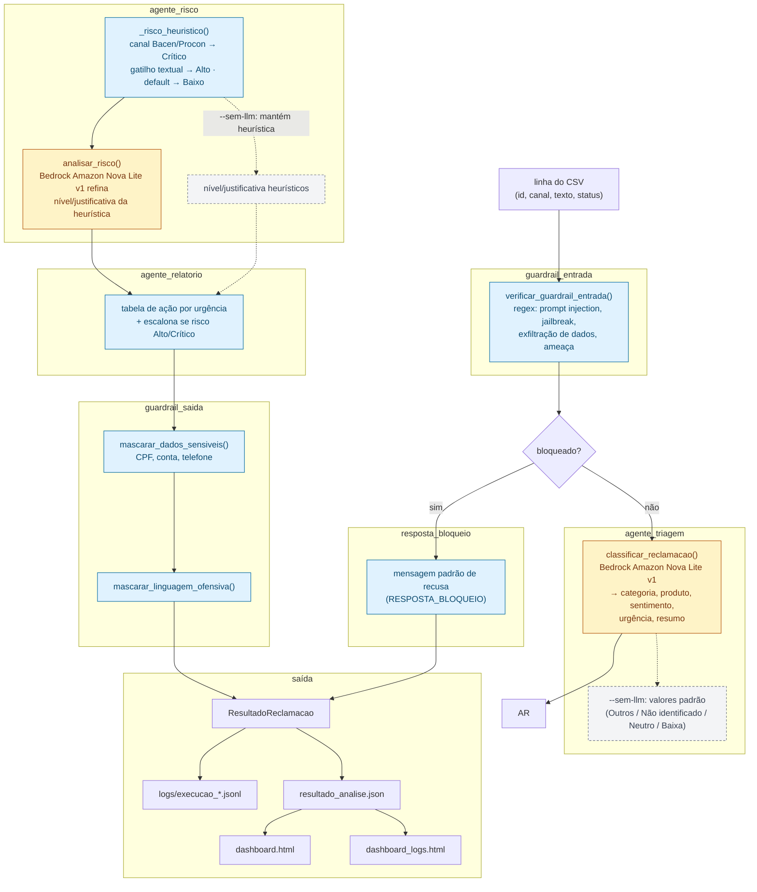
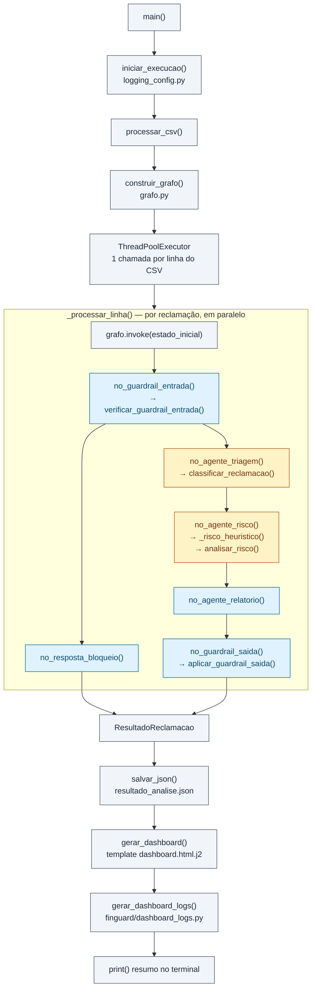

# FinGuard Future Minds

Projeto do desafio Future Minds para análise de reclamações bancárias com pipeline multiagente, guardrails e rastreabilidade.

## Visão geral

O fluxo principal lê reclamações de um CSV e processa cada item em um grafo LangGraph com cinco etapas:

1. guardrail_entrada: bloqueia prompt injection, tentativa de exfiltração e conteúdo malicioso.
2. agente_triagem: classifica categoria, produto, sentimento, urgência e gera resumo.
3. agente_risco: calcula nível de risco regulatório/reputacional.
4. agente_relatorio: define ação recomendada.
5. guardrail_saida: mascara dados sensíveis na saída.

Se a entrada for bloqueada, o fluxo segue para resposta_bloqueio e encerra sem chamar LLM.

### Fluxograma da pipeline (finguard/grafo.py)



**Legenda:**

- 🟦 Código determinístico (regras/regex, sem chamada a LLM): guardrail_entrada, resposta_bloqueio, agente_relatorio, guardrail_saida, e a heurística inicial de risco (`_risco_heuristico`).
- 🟨 Agente IA (chamada a Bedrock, modelo Amazon Nova Lite v1): agente_triagem (classificação) e o refino LLM do agente_risco (`analisar_risco`).
- ⬜ Tracejado: caminho de fallback usado apenas no modo `--sem-llm`, quando o nó roda só com a lógica local/heurística, sem chamar o modelo.

### Fluxograma por função (chamadas de main.py aos módulos)



**Legenda:**

- ⬛ Orquestração (main.py): lê CSV, dispara o processamento paralelo e gera as saídas finais.
- 🟦 Código determinístico (funções de finguard/agentes.py e finguard/guardrails.py): guardrail_entrada, resposta_bloqueio, agente_relatorio, guardrail_saida.
- 🟨 Agente IA (funções de finguard/bedrock_client.py, modelo Amazon Nova Lite v1): `classificar_reclamacao()` e `analisar_risco()`.

## Estrutura principal

- main.py: execução do pipeline principal e geração de saídas.
- finguard/grafo.py: montagem do fluxo no LangGraph.
- finguard/agentes.py: implementação dos nós do grafo.
- finguard/guardrails.py: guardrails de entrada e saída.
- finguard/bedrock_client.py: chamadas Bedrock e parsing das respostas.
- finguard/rag.py: ingestão do PDF da política, chunking e retriever TF-IDF offline.
- finguard/dashboard_logs.py: métricas e dashboard de rastreabilidade.
- script_cluster.py: bônus de clusterização por similaridade.
- templates/dashboard.html.j2: template do dashboard funcional.
- templates/dashboard_logs.html.j2: template do dashboard de logs/tokens.

## Modelos padrão

Atualmente o projeto está configurado para usar Amazon Nova Lite v1 em triagem e risco:

- MODELO_TRIAGEM_PADRAO = amazon.nova-lite-v1:0
- MODELO_RISCO_PADRAO = amazon.nova-lite-v1:0

Esses defaults ficam em finguard/bedrock_client.py.

## Como executar

### 1) Ambiente

Use o Python da venv do projeto para evitar incompatibilidades de dependências.

### RAG da política interna

O RAG é local e reproduzível: `finguard/rag.py` extrai `docs/KS_POLITICA_INTERNA (4).pdf`
com `pypdf`, divide o texto por página/seção em chunks de até 2.400 caracteres com
sobreposição de 300 caracteres e indexa os chunks em TF-IDF. O índice é carregado uma vez
por processo e contém exclusivamente a política, sem reclamações ou logs.

O agente de risco recupera até quatro chunks com similaridade mínima de `0.08`. Os chunks
são enviados ao modelo dentro de `<politica_interna>` como evidência documental, nunca como
instrução. Cada resultado inclui `fontes_politica` com `chunk_id`, página, seção e score.
Quando nenhum chunk supera o limiar, `politica_contexto_disponivel` fica falso e o relatório
solicita validação manual da fonte normativa.

As dependências do RAG são `pypdf` e `scikit-learn`; instale-as com `pip install -r requirements.txt`.

### 2) Execução sem LLM (offline)

```bash
venv/bin/python3 main.py --csv "dados/dataset_finguard_desafio_3 (5).csv" --sem-llm
```

### 3) Execução com Bedrock

```bash
venv/bin/python3 main.py --csv "dados/dataset_finguard_desafio_3 (5).csv" --aws-profile bedrock --aws-region us-east-1
```

Parâmetros úteis da CLI:

- --limit N: limita quantidade de linhas processadas.
- --workers N: paralelismo para chamadas LLM (default: 16).
- --out-json arquivo.json: caminho da saída JSON.
- --out-html arquivo.html: caminho do dashboard funcional.
- --out-html-logs arquivo.html: caminho do dashboard de rastreabilidade.

## Saídas geradas

- resultado_analise.json: resultado consolidado por reclamação.
- dashboard.html: visão analítica de classificação e risco.
- dashboard_logs.html: métricas de execução, latência, erros e tokens.
- logs/execucao_*.jsonl: logs estruturados por execução.

## Bônus de clusterização

Sem LLM:

```bash
venv/bin/python3 script_cluster.py --csv "dados/dataset_finguard_desafio_3 (5).csv" --sem-llm
```

Com Bedrock:

```bash
venv/bin/python3 script_cluster.py --csv "dados/dataset_finguard_desafio_3 (5).csv"
```

Saída: resultado_clusters.json.
